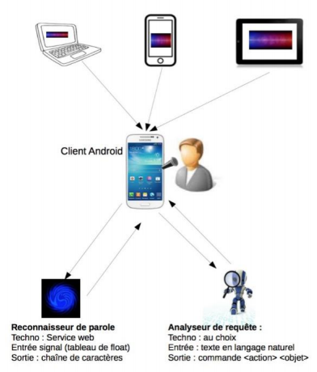

# ************Player Mp3 streaming (Middleware ICE)************

Auteur: TRAN Bao Thien - uapv1900181 - M2 ILSEN CLA

## Architecture

## Serveur développé en Java
- Supportez les fonctions de gestion des morceaux: ajoute, modifie, suppression, recherche, jouez
- Supportez streaming serveur (librairie vlcj - v4.1)
- Cross système (besoin Vlc logiciel)
- Pour compiler: 
    + Utilisez makefile (make)
    + S'il y a quelques problèmes, utiliser Eclipse -> Import -> Maven -> Existing Maven Projects

## Client
### Client développé en Java
- UI console avec menu pour choisir les fonctions
- Supportez de lancer toutes les fonctions de serveur

### Client développé en Python
- UI console avec menu pour choisir les fonctions
- Supportez de lancer toutes les fonctions de serveur
- Pour compiler: python Client.py
- Client développé en C++:
    + Juste quelques fonctionnalités
    + Pour compiler: make
